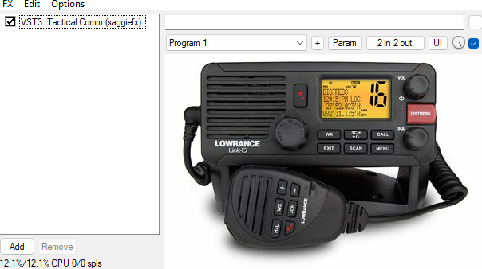

# VHF-Radio-Effect

## Overview
The VHF-Radio-Effect project aims to simulate the distortion characteristics of a VHF radio in real-time using a trained neural network model. By implementing this project in JUCE, we provide users with a platform to create a VHF radio-like effect from a dry voice signal.

## Features
- Real-time simulation of VHF radio distortion.
- Trained neural network model for accurate distortion emulation.
- Implemented in JUCE for cross-platform compatibility.

## Installation
1. **Clone the repository:**
    ```
    git clone https://github.com/your_username/VHF-Radio-Effect.git
    ```

2. **Open the project in your preferred IDE that supports JUCE.**

3. **Build the project according to the instructions provided in the README file.**

## Usage
1. **Load the VHF Radio Effect plugin in your audio workstation or DAW.**
2. **Apply the effect to your audio signal in real-time and enjoy the vintage VHF radio sound.**

Inspiration for real-time neural network processing was drawn from [RTNeural](https://github.com/jatinchowdhury18/RTNeural), an open-source library for interfacing neural networks with audio plugins.

## Neural Network Model
The neural network model included in this project has been trained to learn the distortion characteristics of a VHF radio. It takes the dry voice signal as input and generates a distorted output signal that closely resembles the sound of a VHF radio.

## Sample Files
- **Original Input:** [original.wav](original.wav)
- **Processed Output:** [radiofx.wav](radiofx.wav)

## User Interface


## Heads-up
It is important to note that it is not designed to produce the optimal effect and therefore lacks any control parameters.
This undertaking is experimental in nature, and I will continuously update the repository as I explore and identify the most effective models for creating a VHF communication radio like effect.

## Contributing
Contributions to the VHF-Radio-Effect project are welcome! Feel free to fork the repository, make improvements, and submit pull requests.
